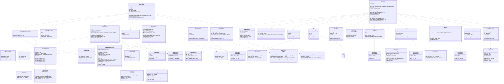

```mermaid
classDiagram

    class CaseRelationship {
        id: str
        type: RelationshipType
        from_party_id: str
        to_party_id: str
        since: str | None = None
        until: str | None = None
        description: str | None = None
    }

    class RiskType {
        <<Enumeration>>
        UNILATERAL_TERMINATION: str = 'unilateral_termination'
        HIGH_LIQUIDATED_DAMAGES: str = 'high_liquidated_damages'
        WAIVER_OF_RIGHTS: str = 'waiver_of_rights'
        NON_COMPETE_OVERBROAD: str = 'non_compete_overbroad'
        MISSING_MANDATORY_TERM: str = 'missing_mandatory_term'
        OTHER: str = 'other'
    }

    class SimilarJudgment {
        judgment_id: str
        similarity: float
        court: str | None = None
        judgment_date: str | None = None
        result_brief: str | None = None
    }

    class ContractRisk {
        id: str
        source_clause_ids: list[str] = list
        risk_type: RiskType = RiskType.OTHER
        severity: RiskSeverity = RiskSeverity.RISK_MEDIUM
        description: str
        rule_id: str | None = None
        ref_laws: list[ContractRefLaw] = list
    }

    class ContractMeta {
        contract_type: ContractType
        title: str | None = None
        signed_date: str | None = None
        effective_date: str | None = None
        termination_date: str | None = None
        governing_law: str | None = '中华人民共和国法律'
        jurisdiction: str | None = None
        language: str = 'zh-CN'
        version: str | None = None
        source: ContractSource = ContractSource.TEMPLATE
    }

    class CaseMeta {
        jurisdiction: Jurisdiction = Jurisdiction.CN
        court: str | None = None
        case_type: str | None = None
        procedure_stage: CaseProcedureStage = CaseProcedureStage.CONSULTATION
        cause: str | None = None
        created_at: str | None = None
        user_id: str | None = None
        language: str = 'zh-CN'
    }

    class LegalIssue {
        id: str
        issue: str
        focus: str | None = None
        priority: PriorityLevel = PriorityLevel.MEDIUM
    }

    class CaseGraph {
        case_id: str
        schema_version: str = '0.1.0'
        source_type: CaseSourceType = CaseSourceType.USER_QUERY
        raw_text: str
        summary: str | None = None
        meta: CaseMeta = CaseMeta
        parties: list[CaseParty] = list
        relationships: list[CaseRelationship] = list
        claims: list[CaseClaim] = list
        facts: list[CaseFact] = list
        evidence: list[CaseEvidence] = list
        legal_issues: list[LegalIssue] = list
        law_candidates: list[LawCandidate] = list
        similar_judgments: list[SimilarJudgment] = list
        timeline: list[CaseTimelineItem] = list
    }

    class ContractParty {
        id: str
        role: str
        name: str
        type: PartyType
        registration_no: str | None = None
        address: str | None = None
        contact: ContractContact = ContractContact
    }

    class ContractDefinition {
        term: str
        definition_text: str
        source_clause_id: str | None = None
    }

    class RightType {
        <<Enumeration>>
        TERMINATE: str = 'terminate'
        INSPECT: str = 'inspect'
        USE_IP: str = 'use_ip'
        WITHHOLD_PAYMENT: str = 'withhold_payment'
        OTHER: str = 'other'
    }

    class ContractPresenceSummary {
        contract_type: ContractType = ContractType.OTHER
        items: list[PresenceItem] = list
    }

    class RiskSeverity {
        <<Enumeration>>
        RISK_LOW: str = 'low'
        RISK_MEDIUM: str = 'medium'
        RISK_HIGH: str = 'high'
    }

    class RelationshipType {
        <<Enumeration>>
        LOAN: str = 'loan'
        LABOR: str = 'labor'
        LEASE: str = 'lease'
        SALE: str = 'sale'
        MARRIAGE: str = 'marriage'
        TORT: str = 'tort'
        OTHER: str = 'other'
    }

    class ContractType {
        <<Enumeration>>
        LABOR: str = 'labor'
        LEASE: str = 'lease'
        NDA: str = 'nda'
        SOFTWARE: str = 'software'
        OUTSOURCING: str = 'outsourcing'
        BUY_SELL: str = 'buy_sell'
        SERVICE: str = 'service'
        OTHER: str = 'other'
    }

    class LawDocType {
        <<Enumeration>>
        STATUTE: str = 'statute'
        JUDICIAL_INTERPRETATION: str = 'judicial_interpretation'
    }

    class EvidenceType {
        <<Enumeration>>
        BANK_RECORD: str = 'bank_record'
        IOU: str = 'IOU'
        CHAT_LOG: str = 'chat_log'
        LABOR_CONTRACT: str = 'labor_contract'
        WITNESS_TESTIMONY: str = 'witness_testimony'
        AUDIO_VIDEO: str = 'audio_video'
        OTHER: str = 'other'
    }

    class ContractCondition {
        id: str
        type: ConditionType
        description: str
    }

    class ConditionType {
        <<Enumeration>>
        SUSPENSIVE: str = 'suspensive'
        RESOLUTORY: str = 'resolutory'
    }

    class CaseSourceType {
        <<Enumeration>>
        USER_QUERY: str = 'user_query'
        JUDGMENT: str = 'judgment'
        MIXED: str = 'mixed'
    }

    class ObligationType {
        <<Enumeration>>
        PAY_SALARY: str = 'pay_salary'
        DELIVER_GOODS: str = 'deliver_goods'
        PROVIDE_SERVICE: str = 'provide_service'
        KEEP_CONFIDENTIAL: str = 'keep_confidential'
        NON_COMPETE: str = 'non_compete'
        OTHER: str = 'other'
    }

    class RemedyType {
        <<Enumeration>>
        LIQUIDATED_DAMAGES: str = 'liquidated_damages'
        PENALTY: str = 'penalty'
        INDEMNITY: str = 'indemnity'
        OTHER: str = 'other'
    }

    class CaseFact {
        id: str
        time: str | None = None
        stage: Literal['pre_litigation', 'during_litigation'] | None = 'pre_litigation'
        description: str
        evidence_ids: list[str] = list
    }

    class ContractClauseCategory {
        <<Enumeration>>
        DEFINITION: str = 'definition'
        SCOPE: str = 'scope'
        PAYMENT: str = 'payment'
        TERM: str = 'term'
        TERMINATION: str = 'termination'
        LIABILITY: str = 'liability'
        CONFIDENTIALITY: str = 'confidentiality'
        IP: str = 'ip'
        DISPUTE_RESOLUTION: str = 'dispute_resolution'
        LABOR_PROTECTION: str = 'labor_protection'
        WORK_TIME: str = 'work_time'
        SOCIAL_INSURANCE: str = 'social_insurance'
        OTHER: str = 'other'
    }

    class ContractRefLaw {
        law_doc_id: str
        law_name: str | None = None
        article_no: str | None = None
        article_range: str | None = None
    }

    class Jurisdiction {
        <<Enumeration>>
        CN: str = 'CN'
        JP: str = 'JP'
        OTHER: str = 'OTHER'
    }

    class ContractAttachment {
        id: str
        title: str
        type: str | None = None
        related_clause_ids: list[str] = list
    }

    class CaseEvidence {
        id: str
        type: EvidenceType
        description: str
        strength: StrengthLevel = StrengthLevel.MEDIUM
        is_disputed: bool = False
    }

    class ContractObligation {
        id: str
        from_party_id: str
        to_party_id: str | None = None
        type: ObligationType = ObligationType.OTHER
        description: str
        amount: float | None = None
        currency: str | None = 'CNY'
        frequency: str | None = None
        due_date: str | None = None
        condition: str | None = None
    }

    class CaseClaim {
        id: str
        claimant_id: str
        respondent_id: str
        type: str
        amount: float | None = None
        currency: str | None = 'CNY'
        other_demands: list[str] = list
    }

    class ContractContact {
        person: str | None = None
        phone: str | None = None
        email: str | None = None
    }

    class ContractRemedy {
        id: str
        type: RemedyType
        description: str
        amount: float | None = None
        multiplier: float | None = None
    }

    class PriorityLevel {
        <<Enumeration>>
        HIGH: str = 'high'
        MEDIUM: str = 'medium'
        LOW: str = 'low'
    }

    class PresenceItem {
        id: str
        label: str
        required: bool = False
        present: bool = False
        source_clause_ids: list[str] = list
    }

    class StrengthLevel {
        <<Enumeration>>
        LOW: str = 'low'
        MEDIUM: str = 'medium'
        HIGH: str = 'high'
    }

    class ContractSource {
        <<Enumeration>>
        TEMPLATE: str = 'template'
        REAL_CASE: str = 'real_case'
        UPLOADED: str = 'uploaded'
    }

    class CaseProcedureStage {
        <<Enumeration>>
        CONSULTATION: str = 'consultation'
        FIRST_INSTANCE: str = 'first_instance'
        SECOND_INSTANCE: str = 'second_instance'
        RETRIAL: str = 'retrial'
    }

    class ContractRight {
        id: str
        party_id: str
        type: RightType = RightType.OTHER
        description: str
    }

    class ContractClause {
        id: str
        clause_no: str | None = None
        title: str | None = None
        category: ContractClauseCategory = ContractClauseCategory.OTHER
        text: str
        ref_laws: list[ContractRefLaw] = list
        obligations: list[ContractObligation] = list
        rights: list[ContractRight] = list
        conditions: list[ContractCondition] = list
        remedies: list[ContractRemedy] = list
    }

    class ContractGraph {
        contract_id: str
        schema_version: str = '0.1.0'
        raw_text: str
        meta: ContractMeta
        parties: list[ContractParty] = list
        definitions: list[ContractDefinition] = list
        clauses: list[ContractClause] = list
        presence_summary: ContractPresenceSummary | None = None
        risks: list[ContractRisk] = list
        attachments: list[ContractAttachment] = list
    }

    class LawCandidate {
        doc_type: LawDocType
        law_name: str
        law_doc_id: str
        article_no: str | None = None
        article_range: str | None = None
        confidence: float = 0.0
    }

    class CaseParty {
        id: str
        role: str
        name: str
        type: PartyType
        attributes: dict = dict
    }

    class CaseTimelineItem {
        time: str
        label: str
        fact_ids: list[str] = list
    }

    class PartyType {
        <<Enumeration>>
        NATURAL_PERSON: str = 'natural_person'
        COMPANY: str = 'company'
        GOVERNMENT: str = 'government'
        OTHER: str = 'other'
    }

    CaseMeta ..> Jurisdiction
    CaseMeta ..> CaseProcedureStage
    CaseParty ..> dict
    CaseParty ..> PartyType
    CaseRelationship ..> RelationshipType
    CaseEvidence ..> StrengthLevel
    CaseEvidence ..> EvidenceType
    LegalIssue ..> PriorityLevel
    LawCandidate ..> LawDocType
    CaseGraph ..> CaseRelationship
    CaseGraph ..> SimilarJudgment
    CaseGraph ..> CaseMeta
    CaseGraph ..> CaseEvidence
    CaseGraph ..> LegalIssue
    CaseGraph ..> CaseSourceType
    CaseGraph ..> CaseClaim
    CaseGraph ..> CaseParty
    CaseGraph ..> CaseTimelineItem
    CaseGraph ..> CaseFact
    CaseGraph ..> LawCandidate
    ContractMeta ..> ContractType
    ContractMeta ..> ContractSource
    ContractParty ..> ContractContact
    ContractParty ..> PartyType
    ContractObligation ..> ObligationType
    ContractRight ..> RightType
    ContractCondition ..> ConditionType
    ContractRemedy ..> RemedyType
    ContractClause ..> ContractRight
    ContractClause ..> ContractRemedy
    ContractClause ..> ContractClauseCategory
    ContractClause ..> ContractObligation
    ContractClause ..> ContractRefLaw
    ContractClause ..> ContractCondition
    ContractPresenceSummary ..> PresenceItem
    ContractPresenceSummary ..> ContractType
    ContractRisk ..> RiskType
    ContractRisk ..> ContractRefLaw
    ContractRisk ..> RiskSeverity
    ContractGraph ..> ContractRisk
    ContractGraph ..> ContractParty
    ContractGraph ..> ContractMeta
    ContractGraph ..> ContractDefinition
    ContractGraph ..> ContractClause
    ContractGraph ..> ContractAttachment
    ContractGraph ..> ContractPresenceSummary


```